<!DOCTYPE html>
<html>
<head>
<meta charset="utf-8">

<!-- Add icon library -->
<link rel="stylesheet" href="https://cdnjs.cloudflare.com/ajax/libs/font-awesome/4.7.0/css/font-awesome.min.css">
<meta name="viewport" content="width=device-width, initial-scale=1">
<title>
Home
</title>
<link rel="stylesheet"  href="bootstrap.css" type="text/css" media="screen"/>
<link rel="stylesheet"  href="style.css" type="text/css" media="screen"/>
<!--[if lte IE 8]>
<link rel="stylesheet"  href="menuie.css" type="text/css" media="screen"/>
<link rel="stylesheet"  href="vmenuie.css" type="text/css" media="screen"/>
<![endif]-->

<!--[if IE 7]>

<![endif]-->
<!--[if lt IE 9]>

<![endif]-->
</head>
<body class="Home">

<nav id="ttr_menu" class="navbar-default navbar">
   

<button id="nav-expander" data-target=".navbar-collapse" data-toggle="collapse" class="navbar-toggle" type="button">

</button>

<ul class="ttr_menu_items nav navbar-nav navbar-right">
<li class="ttr_menu_items_parent dropdown active"><a href="home.html" class="ttr_menu_items_parent_link_active">Home</a>

</li>
<li class="ttr_menu_items_parent dropdown"><a href="about-us.html" class="ttr_menu_items_parent_link">About Us</a>

</li>
<li class="ttr_menu_items_parent dropdown"><a href="qualityControl.html" class="ttr_menu_items_parent_link">quality Control</a>

</li>
<li class="ttr_menu_items_parent dropdown"><a href="products.html" class="ttr_menu_items_parent_link">products</a>

</li>
<li class="ttr_menu_items_parent dropdown"><a href="contact-us.html" class="ttr_menu_items_parent_link">Contact Us</a>

</li>
</ul>

</nav>

 

  
<ul>
<li id="Slide0" class="ttr_slide" data-slideEffect="SlideBottom">

	<h4>  pvc pipe mixed colors is the one of our products</h4>
	
		

</li>
<li id="Slide1" class="ttr_slide" data-slideEffect="SlideBottom">

	<h4> spf  is one of the leading plastic industry in the SOMALIA . for UPVC pipes. The Company was established in the year 2013 and has been pioneering industry in manufacturing UPVC pipes for sewer drain, drainage </h4>
	
		

 

</li>
<li id="Slide2" class="ttr_slide" data-slideEffect="SlideFade in">

	<h4> We at somali plastic factory pvc pipe factory .mogdisho ,somalai  think of ourselves as a different kind of company, doing our part to make the world a better place. This pursuit is realized through an unwavering commitment to leadership in everything we do </h4>

		

</li>
<li id="Slide3" class="ttr_slide" data-slideEffect="SlideRight">

	<h4> Our uPVC pipes are appropriate for a wide variety of purposes like

		Pressure Pipes for water distribution
		Agriculture purpose
		Sewer Pipes for underground drain
		Ventilating Pipes
		Pipes for Electrical & Telephone cables
		Conduits Pipes for Electrical wiring installtions
		We also produce PVC pipes in custom sizes as required by our customers. </h4>

		

</li>
<li id="Slide4" class="ttr_slide" data-slideEffect="SlideLeft">

	<h4> We at somali plastic factory pvc pipe factory .mogdisho ,somali  think of ourselves as a different kind of company, doing our part to make the world a better place.This pursuit is realized through an unwavering commitment to leadership in everything we do </h4>
	
		

</li>
</ul>

Waxaan kuu Haynaa allaab la hubo tayadeeda

Somali plastic caompany best quality and low price pipes

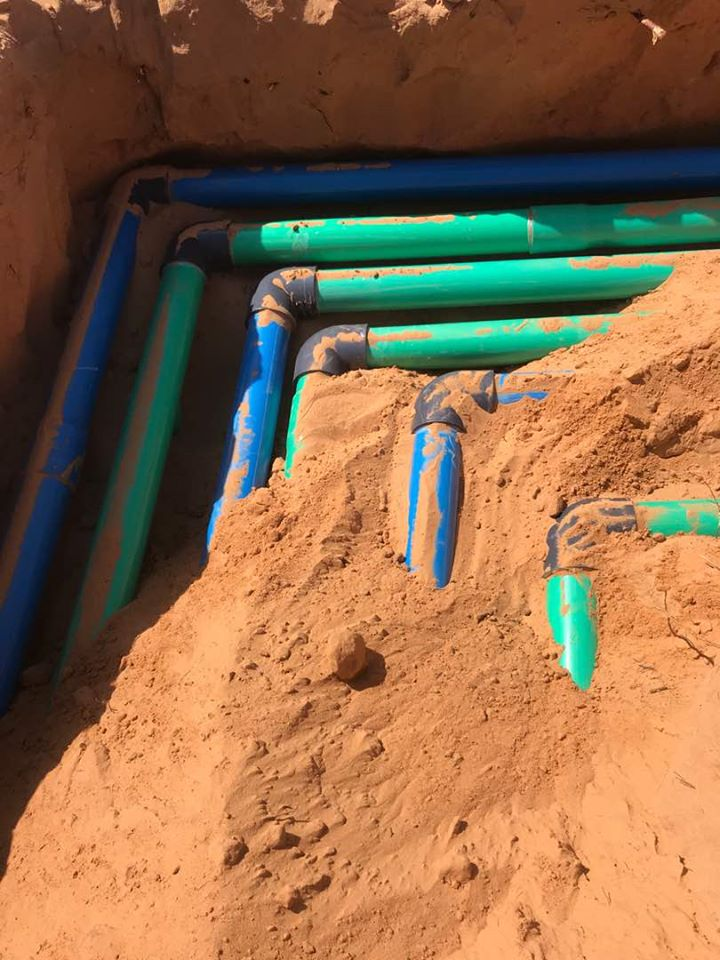Somali plastic

Pvc pipe 200mm high pressure for somali water development

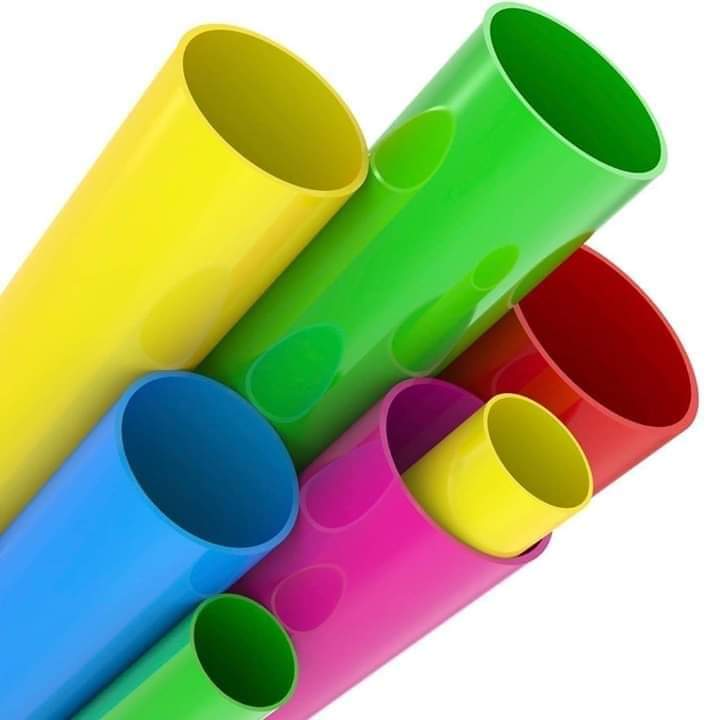Somali plastic factory

pvc pipe new color

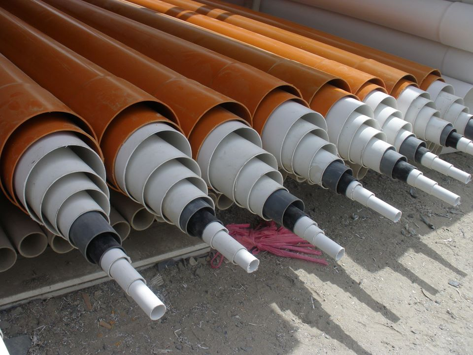Somali plastic factory

  pvc pipe new color

Products

  durable and affordable matterials 

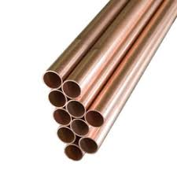L copper pipe

L copper pipe is used for indoor plumbing, fire prevention and some systems with HVAC. It is accessible in rigid and flexible designs, and can be used with fittings for sweating, pressure and flare.

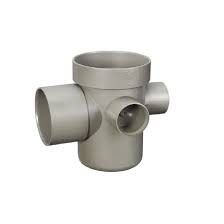UPVC Drainage

UPVC Drain Lower level basin Pipe Floor Drainage for Water

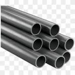Flexible copper pipe

Flexible copper pipe or tubing to water heaters, refrigerators, and some sinks are used for the final runs. Flexible copper is only used for small intervals, and can be quickly cut with a hacksaw. The fit around corners can be bent

 PVC pipe system

PVC is used for the manufacture of pipes, polyvinyl flooring and siding, hoses, cable coatings, medical instruments, and vehicle and electrical wiring parts. It is used for making upholstery products, housewares, shower curtains, raincoats, toys, supplies to colleges, food packaging, and shoes

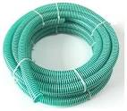Green PVC water pipe

 Green PVC water pipeThe central sewer pipe PVC D 3034 is for sewer and storm drainage purposes only. It is highly resistant to corrosion typically found in sewage and industrial effluents, used in gravity-fed waste disposal systems

uPVC water supply pipe

Ingtong upvc pipe and fitting systems are well known for their reliability, resilience, non-toxicity and corrosion resistance, commonly used in a broad range of applications such as plumbing, water supply, sewage and wastewater, water and drainage, building and development, mining , manufacturing, rural and irrigation, electrical and cellular

 Pvc pipe 200mm high pressure for somali water development

 <marquae> High Pressure Pvc Pipe For Water Supply  </marque> .

<a HREF="#" target="_self" class="btn btn-lg btn-default">read more</a>

Somali plastic products

high quality, affordable and low price

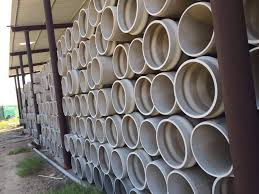

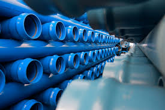

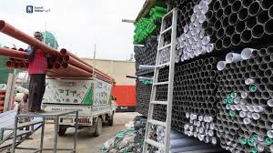

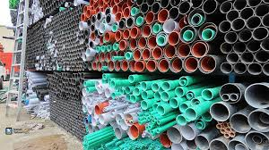

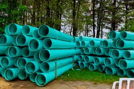

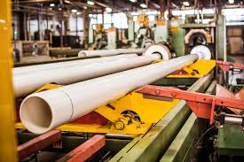

<footer id="ttr_footer">

&nbsp;

 

Somali plastic Company

<a HREF="About-Us.html" class="tt_link" target="_self">ABOUT US</a>

<a HREF="Services.html" class="tt_link" target="_self">products</a>

<a HREF="Projects.html" class="tt_link" target="_self">PROJECTS</a>

<a HREF="Contact-Us.html" class="tt_link" target="_self">CONTACT US</a>

&nbsp;

 

The major markets are

Afgoye

marka

galkio

kismaayo

baydhabo

follow us

      

<a href="#">
2020 copyright All rights  recerved by Somplastic factory
</a>

</footer>

</body>
</html>
